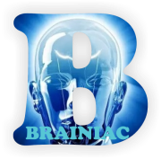

<div align="center">

  <br />
  
  

  <h1 align="center">Oluwasegun Thomas (Brainiac Erudite) - Portfolio</h1>

</div>

<br />

<div align="center">
  Welcome to the portfolio of Oluwasegun Thomas (Brainiac Erudite), showcasing my web development skills. This portfolio is fully responsive and built using modern web technologies including **Vue.js** for the frontend, **Tailwind CSS** for styling, and **PHP** to handle backend email processing.

<a href="https://brainiacerudite.com/"><strong>Live Demo</strong></a>


</div>

<br />

## Demo Screenshots

<div align="center">
  
  
</div>

<br />

## Features

- Fully responsive design optimized for all device sizes.
- Built with **Vue.js 3** and **Tailwind CSS** for a sleek and modern UI.
- **PHP** backend integration to handle email processing via the contact form.
- SEO optimized for better visibility and performance.

## Usage

You are welcome to download, clone, or fork this project and modify it as needed.

1. Clone the repository:
   ```bash
   git clone https://github.com/brainiacerudite/brainiacerudite_website.git
   ```
2. Navigate to the project directory:
   ```bash
   cd brainiacerudite_website
   ```
3. Install the dependencies:
   ```bash
   npm install
   ```
4. Change all necessary details, such as links, resume, images, and social handles.
5. Set SEO data in `index.html`.
6. Start the development server:
   ```bash
   npm run dev
   ```
7. Build the project for production:
   ```bash
   npm run build
   ```

> 🔔 Additionally, you will need a PHP server to handle the email functionality.

## Contributing

Feel free to use this portfolio as inspiration for your own projects. If you find it useful, please consider giving it a star on GitHub!

- ⭐ **Star** this repository to show your support.
- 🖇️ **Fork** this repository to contribute or build your own version.
- 👤 **Follow me** on GitHub for more exciting projects: **[Brainiac Erudite](https://github.com/brainiacerudite)**.

## Acknowledgment

Special thanks to the repository [`codewithsadee/jack-portfolio`](https://github.com/codewithsadee/jack-portfolio) that inspired the design of this portfolio. Their work was a great source of inspiration for the UI and overall structure of this project.

### License

This project is **free to use** and does not contain any license.
